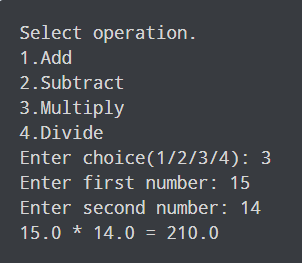

# Python Calculator
make a alculator with python 
# Setup
Just Run the File.
# image

# İnformation
this code has been published on instagram address peyxw
https://www.instagram.com/peyxw/
# Source
https://www.programiz.com/python-programming/examples/calculator

